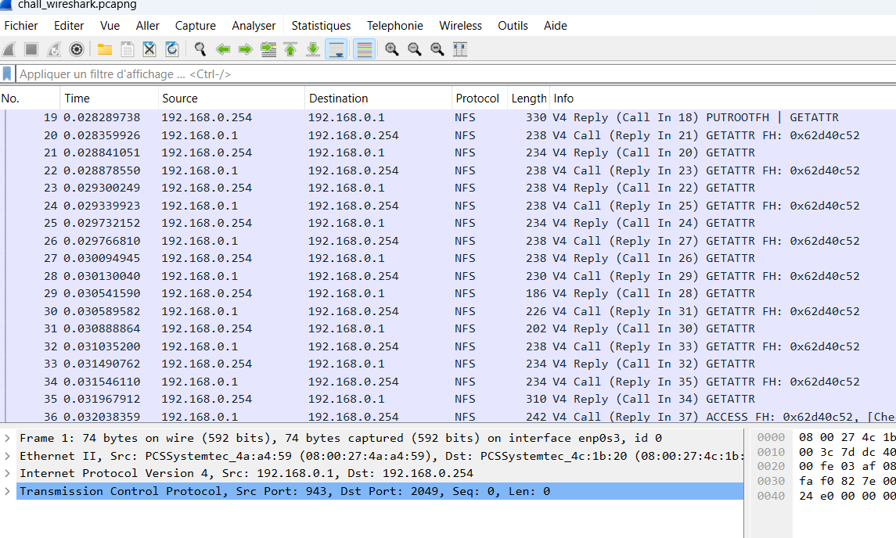
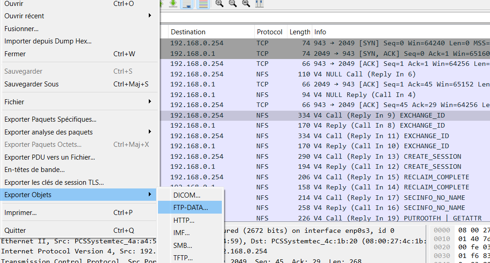
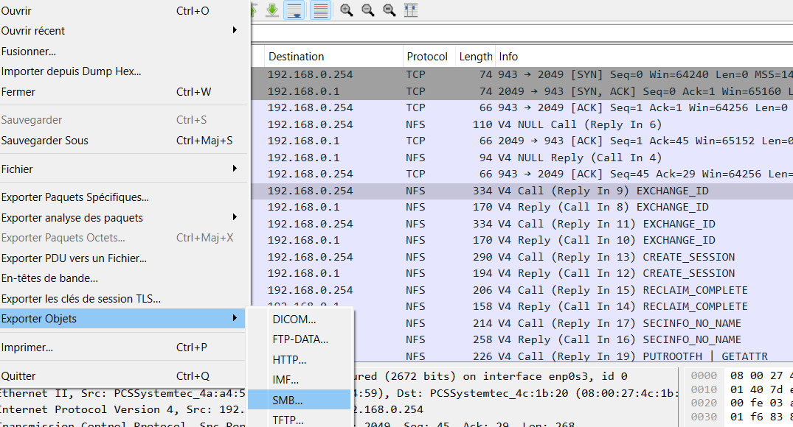
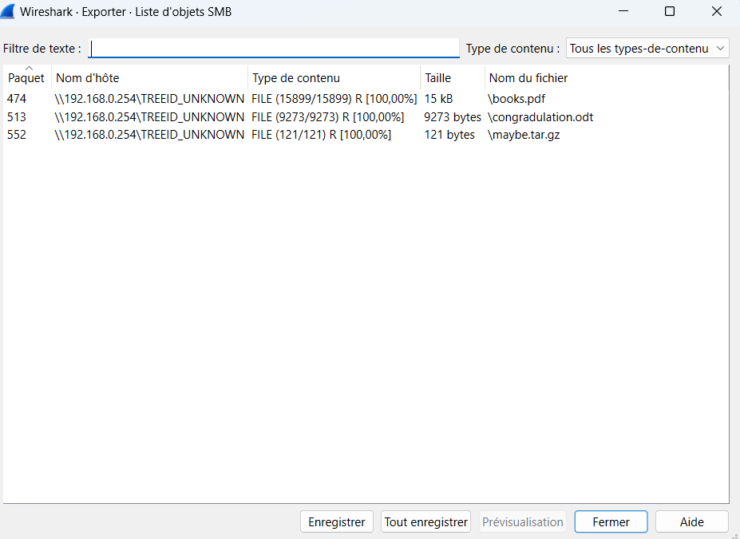

# Challenge RootMe Extraction de données

## 20 Points 
SMB, FTP, NFS

### Auteur
Tidusrose,  28 mai 2024
Niveau  Difficulté
Validations
207 Challengeurs 1% de réussite

#### Challenge Trouver le mot de passe
* Votre professeur de réseau vous fournit cette capture en vous demandant d’essayer de retrouver les fichiers qu’il a fait transiter sur votre lab de test.

* Le flag est la concatenation des trois flags présents dans les fichiers.

Bonne chance ! :)

* sha256sum:66adb6a6a6c96c486e9f1856bf5039ab3b7a713b2a94e834ed281e7444f8aea7

## Réponse 

* le sha256sum est le hash du fichier :  **chall_wireshark.pcapng** qui est donné dans le challenge.

 

 

 
* Pour voir s'il y a des fichiers à exporter aller dans fichier en haut à droite puis exporter paquet selon le type SMB FTP NFS.

 

* Cliquer sur tout enregistrer en choisissant le dossier choisi, les fichiers seront enregistrer sur celui-ci, les consulter avec l'explorateur de fichiers.

 

* Même opération que ci-dessus.
* Les deux premiers flags sont dans books.pdf et %2fhome%2ftidusrose%2fFTP%2fcat2.png
  

  

* Le dernier flag est dans la récupération des fichiers qui apparaissent dans les paquets NFS dans l'image ci-dessus mais je n'ai pas réussi à les reconstituer.

